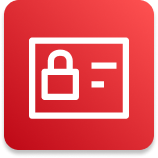

# AWS Certified Developer Associate - Study Guide 📚☁️

Esse repositório é um rodmap com os pontos mais importantes de todo conteúdo que consumi durante minha preparação para a certificação **AWS Developer Associate**.
 
A idéia é trazer um guia de estudos com conceitos fundamentais sobre o que é cobrado no exame.
- **O repositório está organizado por tópicos e serviços relevantes para a certificação, todo conteúdo está contido nesse README e também pode ser acessado pelos arquivos .md**

## Sobre o Exame 🎯

A certificação **AWS Certified Developer Associate** tem como objetivo validar seus conhecimentos sobre ferramentas de desenvolvimento dentro da AWS. Para essa certificação é recomendado que você tenha pelo menos 1 ano de exeperiência com desenvolvimento na AWS. 
Isso pode ser adquirido por meio de labs práticos disponíveis no skillbuilder https://aws.amazon.com/pt/training/digital/ ou por meio de projetos profissionais e pessoais livres. Abuse do Free Tier para experimentar os recursos.  
- O exame tem 65 questões de múltipla escolha e mútipla alternativa(com 2 selecões ou 3 selecões) as questões de múltipla escolha têm 4 alternativas e as de múltipla alternativa têm 5 ou 6 alternativas.
- A pontuacao é contabilizada numa escala de 100-1000, sendo considerado aprovado quem tem pontuacão >= 720. Essa pontuacão não representa percentual de acerto, existem questões que valem mais que outras e algumas tem pontuacão zerada por serem de caráter experimental e 
  estatístico. Dentro da minha experiência com simulados oficiais, o menor número de acertos que fiz pra atingir 720 pontos foram 37 questões aka 57% de acerto, lembrando que acertar esse número de questões não é garantia de aprovacão, um número seguro seria acima de 45 questões.
- A duracao do exame é de 130 Minutos. Você pode ter 30 minutos acrescidos se optar por fazer em inglês e for um não nativo do idioma.
- Preco: $150 USD. Com frequência a AWS distribui vouchers de 33-50% de desconto pra certificacoes de nível associate. Além de 50% de desconto pra quem conseguiu certificar a Cloud Practitioner. 
- O exame é dividido por área de conhecimento e cada área de conhecimento tem um peso:
  
| **Domínio**                     | **Peso** | **Principais Serviços**                                                                                   |
|----------------------------------|-----------------|----------------------------------------------------------------------------------------------------------|
| Desenvolvimento                 | 32%             | AWS EC2, AWS Lambda, API Gateway, AWS SDK, AWS CLI, AWS CDK, AWS SAM, DynamoDB, AWS RDS, AWS Aurora, ElastiCache, AWS S3, AWS EFS, AWS EBS, CloudFront, Route 53, Step Functions, AWS SNS, AWS SQS, Amazon Kinesis, AWS AppSync, AWS Athena, AWS OpenSearch Service,|
| Segurança                       | 26%             | AWS IAM, AWS STS, AWS Cognito, Certificate Manager (ACM), AWS KMS, AWS Secrets Manager, AWS WAF, AWS VPC|
| Deployment                      | 24%             | AWS Elastic Beanstalk, AWS CodePipeline, AWS CodeBuild, AWS CodeDeploy, AWS CodeCommit, AWS CloudFormation, AWS CodeGuru, Amazon ECS/EKS/ECR/Fargate, AWS Amplify               |
| Otimização e Solução de Problemas | 18%             | Amazon CloudWatch, AWS Cloud Trail, AWS X-Ray, AWS Trusted Advisor, AWS EventBridge, Elastic Load Balancind (ELB), Auto Scaling Group (ASG),                                          |

 
Para mais detalhes: https://d1.awsstatic.com/training-and-certification/docs-dev-associate/AWS-Certified-Developer-Associate_Exam-Guide.pdf

# Conteúdo do Exame 📚🌐
Nessa secão vou organizar o conteúdo do exame de acordo com o tipo do serviço.

Alguns grupos de serviços são considerados essenciais para compreensão do funcionamento básico de uma topologia cloud, é boa ideia comećar por aqui:
- Identidade e Segurança
- Computação
- Armazenamento
- Redes
- Bancos de dados
- Observabilidade e Auditoria

O foco princiapl fica por conta das ferramentas de desenvolvimento, e é aqui que está a carga de complexidade desse exame, A AWS vai fazer muitas perguntas relacionadas ao funcionamento detalhado desses serviços e como resolver problemas utilizando eles:
- Deploy
- Development Tools
- App integration
- Data Ingestion and Analytics
- Containers

<h1 align= "center"> 
  🔒 **Segurança e Identidade**
   
</h1>

  
 
    <h2 align="center">
IAM
    </h2>

 
  
- [Cognito](Cognito.md) 👤

### 🖥️ ****Computacão****

- [EC2](EC2.md) 💻
- 
- [Lambda](Lambda.md) 🔧
- [ECS](ECS.md) 🐋
- [EKS](EKS.md) 🛞

### 🖥️ ****Desenvolvimento (32%)****

- [API Gateway](API-Gateway.md) 🌐
- [Lambda](Lambda.md) λ
- [Elastic Beanstalk](Elastic-Beanstalk.md) 🌱
- [CodeArtifact](CodeArtifact.md) 📦
- [CodeBuild](CodeBuild.md) ⚙️
- [CodeDeploy](CodeDeploy.md) 🚀
- [CodeCommit](CodeCommit.md) 💼
- [CodePipeline](CodePipeline.md) 🔄
- [CodeStar](CodeStar.md) ⭐
- [CloudFormation](CloudFormation.md) 🏗️
- [SAM (Serverless Application Model)](SAM.md) 🐿️
- [SDK (Software Development Kit)](SDK.md) 🔧
- [CDK (Cloud Development Kit)](CDK.md) ☁️
- [X-Ray](X-Ray.md) 🔍

### 💾 **Armazenamento**

- [S3](S3.md) 🗂️
- [EBS](EBS.md) 🗂️
- [EFS](EFS.md) 🗂️

### 🏗️ **Infra Estrutura**

- [Elastic Load Balancer (ELB)](ELB.md) ⚖️
 
### 🌐 **Rede**

- [Route 53](Route53.md) 🌍
- [VPC](VPC.md) 🖧
- [CloudFront](CloudFront.md) ⚡
- [Global Acelerator](GlobalAcelerator.md) 📡

### 🔍 **Monitoramento**

- [CloudWatch](CloudWatch.md) ⏰
- [CloudTrail](CloudTrail.md) 📑
  
### 🚀 **Desenvolvimento de Aplicações e Integração com AWS**

- [SQS](SQS.md) 📦
- [SNS](SNS.md) 📢
- [Kinesis](Kinesis.md) 🔄

### 🎲 **Banco de Dados**

- [DynamoDB](DynamoDB.md) 📊
- [Aurora](Aurora.md) 🌌
- [RDS](RDS.md) 🗄️

### 🛠️ **Ferramentas de Desenvolvimento**

### ⚡ **Eventos e Integração**

- [EventBridge](EventBridge.md) 🌩️
  
## Como Usar Este Repositório 🧑‍💻

1. **Navegação pelos Tópicos**: Cada diretório contém materiais específicos sobre um determinado serviço ou conceito. Abra os arquivos `.md` para ler os resumos, entender os conceitos principais e acessar links para mais detalhes, como a documentação oficial da AWS.
2. **Exemplos de Código**: Alguns tópicos contêm exemplos de código prontos para você experimentar e entender como integrar os serviços da AWS em seus próprios projetos.
3. **Atualizações Regulares**: Este repositório será atualizado constantemente com novos conteúdos, links úteis e exemplos para garantir que você tenha as informações mais recentes sobre a certificação.

## Contribuindo 🤝

Este repositório é colaborativo! Se você tem sugestões, correções ou novos materiais que gostaria de adicionar, fique à vontade para abrir uma **issue** ou enviar um **pull request**.

### Como Contribuir:

1. **Faça um fork do repositório**.
2. **Crie um branch** para a sua contribuição.
3. **Faça suas alterações** e **comite** suas mudanças.
4. **Envia um pull request** explicando o que foi alterado.

## Licença 📜

Este repositório é licenciado sob a [MIT License](https://opensource.org/licenses/MIT). Sinta-se livre para usar e contribuir com o conteúdo.

## Referências 🌐
- [Documentação Oficial da AWS](https://aws.amazon.com/documentation/)
- [AWS Certified Developer - Associate Exam Guide](https://aws.amazon.com/certification/certified-developer-associate/)

## Contato 📬

Se você tiver alguma dúvida ou sugestão, sinta-se à vontade para abrir uma **issue** ou entrar em contato através do GitHub.

---

**Boa sorte nos seus estudos e no exame de certificação!** 🎓🚀

