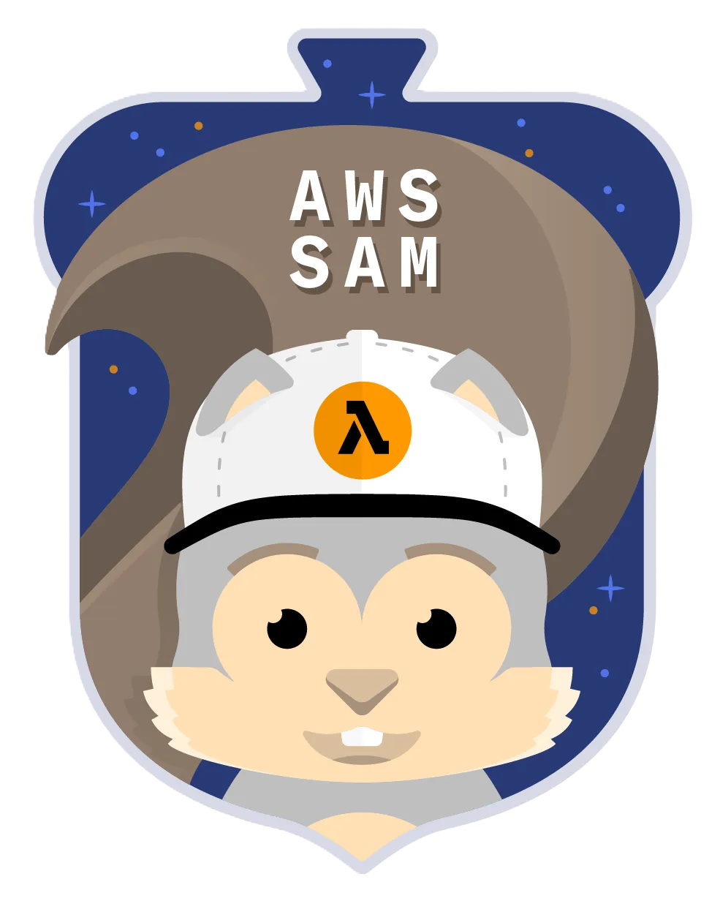

<p align= "center">
  
<br />
    <h1 align="center">
SAM
    </h1>
</p>

O SAM é o nosso caçula aqui. Foi lançado em novembro de 2022 e é extremamente prático pro dia-a-dia. O AWS SAM (Serverless Application Model) é uma estrutura para construir, testar e implantar aplicações serverless na AWS. Ele funciona como uma extensão do AWS CloudFormation.

## Como ele funciona
  1. Você cria um arquivo template.yaml onde descreve sua aplicação serverless (Também é possível usar alguns modelos prontos)
  2. Teste localmente (com sam local invoke)
  3. Empacote e implante na AWS (com os comandos sam build e sam deploy).
  4. Transformação para CloudFormation: O SAM transforma o template simplificado em um template completo do AWS CloudFormation.
  5. Após implantada, sua aplicação é gerenciada como pilhas de CloudFormation, o que facilita a manutenção, atualização e exclusão.

## Quando usar o AWS SAM?
- Use o AWS SAM sempre que estiver construindo uma aplicação serverless, especialmente se ela envolver:
- Funções Lambda.
- APIs gerenciadas pelo API Gateway.
- Bancos de dados DynamoDB ou S3.
- O exame pode te cobrar sobre testes de locais de funções lambda utilizando o CLI, por exemplo. E o SAM é a alternativa certa pra esse tipo de cenário.


# Diretórios

```plaintext
my-sam-app/
├── template.yaml         # Arquivo principal do SAM (infraestrutura como código)
├── events/               # Exemplos de eventos para teste local
│   ├── event.json
├── src/                  # Código fonte das funções Lambda
│   ├── app.py
│   ├── requirements.txt  # Dependências da aplicação
├── tests/                # Testes unitários e de integração
│   ├── unit/
│   │   ├── test_handler.py
│   ├── integration/
├── README.md             # Documentação do projeto

```

## Comandos para se lembrar
- Comando -sam package: O SAM processa seu arquivo template.yaml, empacota o código da função Lambda e seus recursos auxiliares (como dependências) e os prepara para implantação.
- Comando -sam deploy: Implanta no cloud formation

## Transform (Isso é importante!)
- O Transform é usado para simplificar a definição de recursos serverless no modelo YAML/JSON, traduzindo-os para recursos detalhados de CloudFormation.
- Se o SAM é como um atalho para criar aplicações serverless, o Transform é o mecanismo que traduz esses atalhos em instruções completas para o CloudFormation.

## :books: Referências
 - *https://docs.aws.amazon.com/serverless-application-model/*
<br />
<br />